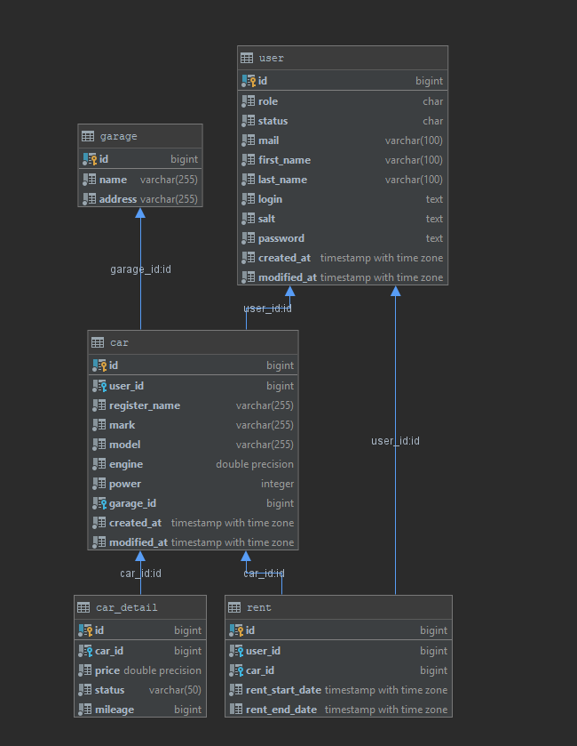
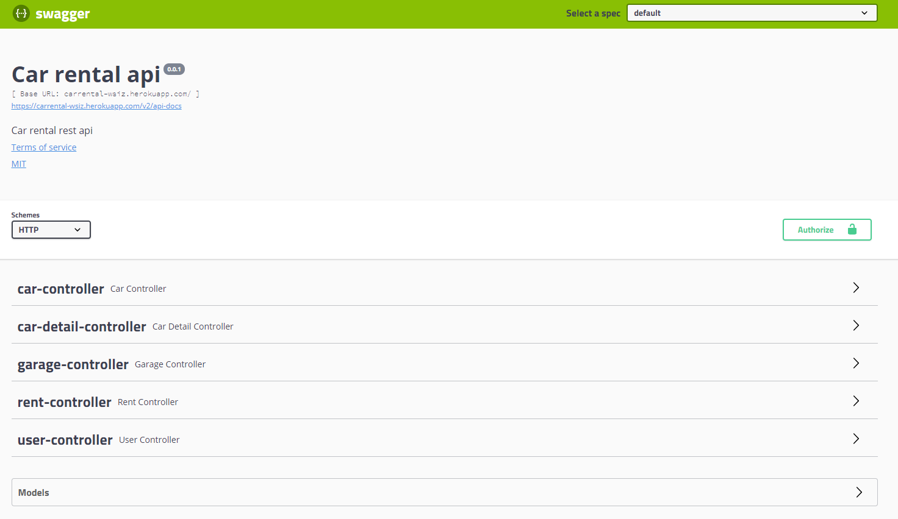

# Carrental

# Description

Simple restful api where u can manage your carrental service and rent cars.


# Authentication
The REST API is currently secured with OAuth2.

# Exploring the REST API
Start the application. This application comes with built in Swagger UI client. It is exposed at the following endpoint
http://localhost:8080/swagger-ui.html.


# Deploy and configuration
- ``` git clone https://github.com/Trev0N/carrental.git ```
- Create database in Postgres 
- Edit ```application.yml``` in resources accordingly to your database settings
- Run application as Spring Boot app in IDE
-  Alternatively you can build a jar using ```mvn clean install spring-boot:repackage``` and run it by ```java -jar carrental-0.0.1.jar```

# Technology Stack

The project uses the following technologies: <br/>
- **language**: Java 1.8 <br/>
- **REST**: [Spring Boot](http://www.springsource.org/) 2.0.3 <br/>
- **persistence**: [Spring Data JPA](http://www.springsource.org/spring-data/jpa) 2.0.8 and [Hibernate](http://www.hibernate.org/) 5.2.17 <br/>
- **persistence providers**: PG SQL
- **testing**: [junit](http://www.junit.org/) 4.1.2 , [mockito](http://code.google.com/p/mockito/) 2.15 <br/>
